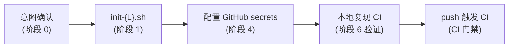

# Pangu (盘古) —— 工业级项目初始化技能

[English](README_EN.md)

[](https://github.com/Kirky-X/pangu/releases) [](LICENSE)

Pangu 是一个面向 AI agent 的工业级项目初始化 skill，把一个空目录变成带**完整质量护栏**的生产级项目：语言脚手架 + Git + GitHub CI 质量门禁 + tag 触发的 Release 发布工作流 + 本地 commit 前 pre-commit/lefthook 双重工业级检查 + 覆盖率门禁（行业底线 80%）。

覆盖 **9 种语言** + **3 种多语言混合形态**，模板与脚本均预存于 skill 目录，直接复制/调用，不凭空生成。完整路由表与流程文档见 [SKILL.md](SKILL.md)。

## 功能特性

### 9 种语言一键初始化

| 语言 | init 脚本 | 包管理/构建 | 安全工具 | 覆盖率工具 | 发布 registry（条件） |
| ---- | --------- | ----------- | -------- | ---------- | ------------------- |
| Rust | init-rust.sh | cargo | cargo-audit + cargo-deny + Miri | cargo-llvm-cov / tarpaulin | crates.io |
| Python | init-python.sh | uv / pip | bandit + pip-audit + ruff | pytest-cov | PyPI |
| Node/TS | init-node.sh | pnpm / npm | eslint-plugin-security + npm audit | vitest-cov / c8 | npm |
| Java | init-java.sh | Maven / Gradle | SpotBugs+FindSecBugs + OWASP Dep-Check | JaCoCo | Maven Central |
| Go | init-go.sh | go modules | gosec + govulncheck | go test -cover + covdata | GitHub Release |
| C/C++ | init-cpp.sh | CMake + Ninja | cppcheck + flawfinder + clang-tidy | gcov + lcov / gcovr | GitHub Release |
| Ruby | init-ruby.sh | bundler | brakeman + bundler-audit | simplecov | RubyGems |
| PHP | init-php.sh | composer | psalm(security) + composer-audit | phpunit --coverage | Packagist |
| .NET | init-dotnet.sh | dotnet CLI | SecurityCodeScan + dotnet format analyzers | coverlet + reportgenerator | NuGet |

> 通用 GitHub 生态文件（dependabot、codeql、issue/pr 模板、CODEOWNERS、editorconfig）在 `templates/common/`，所有语言共享。

### 3 种多语言混合形态

| 形态 | 判定 | 脚本 | 布局 |
| ---- | ---- | ---- | ---- |
| 并存型 monorepo | 多语言各自独立、互不调用 | `init-multi.sh <l1,l2,...>` | 各 `<lang>/` 子目录，根共享 harness |
| FFI rust→python | rust 核心 + python 绑定（PyO3/maturin） | `init-rust-pyo3.sh` | rust+python **同根** |
| FFI rust→node | rust 核心 + node 绑定（napi-rs） | `init-rust-napi.sh` | rust+node **同根** |

### 质量护栏

- **门禁即代码**：`.pre-commit-config.yaml` 为门禁单一来源（检查项最全），lefthook + CI 镜核心子集，阈值统一避免「本地过、CI 红」
  - **fast 核心**（格式 / lint / license-deny）→ pre-commit + lefthook + CI 三处一致，每次提交即跑
  - **slow**（覆盖率 ≥80% / 安全审计）→ lefthook `pre-push` + CI，阈值一致
- **条件发布**：Release 工作流默认产出 GitHub Release 产物；**仅当对应 secret 存在**时才推 registry（crates.io / PyPI / npm / Maven Central / RubyGems / Packagist / NuGet），无 secret 不报错只跳过
- **覆盖率行业底线 80%**：核心业务逻辑 85%+，工具类 70%+

## 安装

### 方式一：通过 `skills` 包安装（推荐）

需 [Node.js](https://nodejs.org/) 18+ 和 `skills` npm 包（v1.5.12+）。`skills` 是 open agent skills 生态的 CLI，支持 68+ agents（Claude Code / Trae / Cursor / Codex / OpenCode 等）。

```bash
# 安装到 Claude Code
npx skills add https://github.com/Kirky-X/pangu.git --agent claude-code -y

# 等价简写（owner/repo）
npx skills add Kirky-X/pangu --agent claude-code -y

# 安装到 Trae
npx skills add Kirky-X/pangu --agent trae -y

# 列出仓库中可被发现的所有 skills（不安装）
npx skills add https://github.com/Kirky-X/pangu.git --list
```

安装后 skill 文件位于对应 agent 的 skills 目录（如 `.claude/skills/pangu/`）。

### 方式二：传统 git clone

```bash
git clone https://github.com/Kirky-X/pangu.git
# 将 SKILL.md + references/ + scripts/ + templates/ 链接或复制到 agent skills 目录
# 各 runtime 的 skills 目录路径示例（任选其一）：
#   Claude Code:  ~/.claude/skills/pangu/
#   Trae:         ~/.trae-cn/skills/pangu/
#   Cursor:       ~/.cursor/skills/pangu/
#   Codex:        ~/.codex/skills/pangu/
```

## 使用示例

Pangu 作为 skill 被 agent 加载后，通过自然语言意图触发，无需显式命令。触发词包括「初始化项目」「新建项目」「搭建 CI」「配置 pre-commit」「release 工作流」「项目脚手架」「工业级代码检查」等。

```bash
# 1. 进入目标目录（空目录最佳）
cd /path/to/project

# 2. 调用对应语言的一键脚本（脚本自包含：语言脚手架 + 拷贝 harness + git init + 装 hooks）
bash ~/.claude/skills/pangu/scripts/init-rust.sh my-project

# 多语言混合项目走专属脚本：
# 并存型:        bash scripts/init-multi.sh rust,python,node my-monorepo
# FFI rust→python: 先 maturin new --mixed --bindings pyo3 <name>，再 bash scripts/init-rust-pyo3.sh
# FFI rust→node:   先 napi new，再 bash scripts/init-rust-napi.sh
```

每个 `init-{L}.sh` 内部统一做 4 件事：语言原生脚手架 → 拷贝 `templates/common/` + `templates/{L}/` → `git init` + 首次 stage（不自动 commit）→ 安装本地 hooks（pre-commit + lefthook 二者皆装，用户择一启用）。

## 能力概览

### `references/` —— 工具链与规范参考

| 文件 | 内容 | 何时读 |
| ---- | ---- | ------ |
| [`languages.md`](references/languages.md) | 9 语言工具链速查（含本地复现命令） | 阶段 1 / 6 |
| [`coverage-standards.md`](references/coverage-standards.md) | 行业覆盖率门禁标准 | 配置覆盖率阈值 |
| [`hooks-compare.md`](references/hooks-compare.md) | pre-commit vs lefthook 选型 | 阶段 2 |
| [`registry-secrets.md`](references/registry-secrets.md) | 各 registry secret 配置 | 阶段 4 |
| [`multi-language.md`](references/multi-language.md) | 多语言项目指引（决策树 + hook 合并） | 混合项目 |

### `scripts/` —— 一键初始化脚本

| 脚本 | 用途 |
| ---- | ---- |
| `init-rust.sh` / `init-python.sh` / `init-node.sh` / `init-java.sh` / `init-go.sh` / `init-cpp.sh` / `init-ruby.sh` / `init-php.sh` / `init-dotnet.sh` | 9 语言单语言一键初始化 |
| `init-multi.sh` | 并存型 monorepo 编排 |
| `init-rust-pyo3.sh` | FFI rust→python（maturin/PyO3） |
| `init-rust-napi.sh` | FFI rust→node（napi-rs） |
| `install-hooks.sh` | 本地 hook 安装 |
| `_common.sh` | 公共函数库（被各 init source，改脚本前必读） |

### `templates/` —— 预存 harness 模板

```
templates/
├── common/          # GitHub 生态共享（dependabot / codeql / issue-pr 模板 / CODEOWNERS / editorconfig / LICENSE-MIT）
└── {rust,python,node,java,go,cpp,ruby,php,dotnet}/  # 各语言专属 CI / release / hook / 配置
```

## 完整流程链路



1. **阶段 0 · 意图确认**：语言 / 包管理器 / 是否发 registry / 项目路径（破坏性操作前必须确认）
2. **阶段 1 · 语言初始化**：调用 `init-{L}.sh` 完成脚手架 + harness + git init + 装 hooks
3. **阶段 2 · 本地 hook**：择一启用 pre-commit（`pre-commit install`）或 lefthook（`lefthook install`）
4. **阶段 3 · GitHub CI 门禁**：checkout → 格式 → lint → 安全 → 测试 + 覆盖率 ≥80%，任一步非零退出 = 阻断合并
5. **阶段 4 · Release 发布**：推 `v*` tag 触发，构建产物 → GitHub Release → 条件推 registry
6. **阶段 5 · 依赖与安全护栏**：Dependabot + CodeQL + 各语言专属 SCA
7. **🛑 阶段 6 · 验证（STOP）**：本地复现 CI + hook 触发验证 + 文件清点 + YAML 语法检查

## 许可证

MIT
