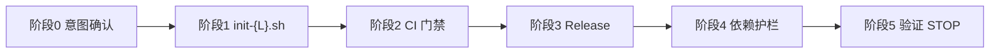

# Pangu（盘古）— 项目 Harness 初始化技能

> 把空目录变成带完整质量护栏的项目：语言脚手架 + Git + GitHub CI 质量门禁 + tag 触发的 Release 发布 + 本地 pre-commit/lefthook 双检查 + 覆盖率门禁（底线 80%）。

[](https://github.com/Kirky-X/pangu/releases) [](https://github.com/Kirky-X/pangu/releases) [](LICENSE)

中文 | [English](README_EN.md)

## ✨ 功能特性

- **9 语言一键初始化**：Rust / Python / Node / Java / Go / C++ / Ruby / PHP / .NET，每语言配套专属 CI 模板、Release 工作流、安全扫描（cargo-audit、bandit、gosec、OWASP Dep-Check 等）与覆盖率工具
- **3 种混合形态**：并存型 monorepo（`init-multi.sh`）、FFI rust→python（`init-rust-pyo3.sh`）、FFI rust→node（`init-rust-napi.sh`）
- **第 10 种项目类型：skill 仓库本身**：`init-skill.sh` 一键初始化标准 skill 仓库；`align-skill.sh` 对齐存量 skill（`--dry-run`/`--fix`）；`bump-skill-version.sh` 传播版本号
- **门禁即代码**：`.pre-commit-config.yaml` 为门禁单一来源，lefthook + CI 镜核心子集，阈值统一（fast 核心：格式/lint/license-deny；slow：覆盖率 ≥80% + 安全审计 → pre-push + CI）
- **覆盖率门禁真实生效**：Go/Ruby CI 用 `--cov-fail-under=80` / awk 阈值判定硬失败，不以 `|| true` 中和；上传统一走官方 `codecov-action@v4`；Go 的 gosec 钉版 `@v2.21.4`
- **条件发布**：Release 工作流（`v*` tag 触发）无条件产出 GitHub Release；仅当对应 secret 存在才推 registry（crates.io / PyPI / npm / Maven Central / RubyGems / NuGet），无 secret 跳过不报错
- **自身 CI SHA-pin**：pangu 仓库的 workflows 对所有第三方 action 使用 commit SHA 固定引用
- **依赖护栏**：Dependabot + CodeQL + 各语言专属 SCA

## 📦 安装

```bash
# 方式一：从本工作区统一部署（部署到 ~/.zcode/skills 与 ~/.claude/skills）
bash scripts/sync-skills.sh pangu

# 方式二：手动复制到 ZCode 技能目录
cp -r /path/to/pangu ~/.zcode/skills/pangu

# 方式三：远程安装（GitHub 仓库）
npx skills add Kirky-X/pangu --agent claude-code -y
```

## 🚀 快速开始

前置条件：目标语言工具链（如 Python 需 `uv`，Rust 需 `cargo`）；`$SKILL` 为 skill 安装目录（如 `~/.zcode/skills/pangu`）。

```bash
cd /path/to/project   # 空目录最佳；已有项目目录会被覆盖部分配置，先确认

# 语言初始化（脚本自包含：语言脚手架 + harness 模板 + git init + 装 hooks）
bash "$SKILL/scripts/init-python.sh" my-project
bash "$SKILL/scripts/init-rust.sh" my-project

# 混合项目
bash "$SKILL/scripts/init-multi.sh" rust,python,node my-monorepo   # 并存型
# FFI：先 maturin new --mixed --bindings pyo3 <name>（或 napi new），再跑 init-rust-pyo3.sh / init-rust-napi.sh

# skill 仓库初始化（meta 模式）
bash "$SKILL/scripts/init-skill.sh" my-skill --cn-name 我的技能
```

初始化后按提示：启用本地 hook（`pre-commit install` 或 `lefthook install` 二选一）→ 本地复现 CI 等价命令全绿 → 配置发布 secret（可选）→ push 触发 CI / 推 `v*` tag 触发 Release。


```mermaid
flowchart LR
    A["阶段0 意图确认"] --> B["阶段1 init-{L}.sh"] --> C["阶段2 CI 门禁"] --> D["阶段3 Release"] --> E["阶段4 依赖护栏"] --> F["阶段5 验证 STOP"]
```

## ✅ 测试与验证

2026-09-13 实测（v0.1.4，与 git tag 一致）：

- **自检门禁**：`bash scripts/selfcheck.sh` 全部通过 — shellcheck 检查 20 个脚本 0 错误、YAML lint 校验 27 个模板文件、9+1 语言模板完整性（ci.yml / release.yml / .pre-commit-config.yaml / lefthook.yml / .gitignore）通过
- **功能实测**（临时目录）：
  - `init-python.sh demo-py`：产出 `pyproject.toml` + `src/` + `.pre-commit-config.yaml` + `lefthook.yml` + `.github/workflows/{ci.yml,codeql.yml,release.yml}`，CI 含 `uv run pytest --cov --cov-fail-under=80`
  - `init-rust.sh demo-rs`：产出 `Cargo.toml` + `rustfmt.toml` + `clippy.toml` + `deny.toml` + 同套 workflows
  - Go/Ruby 模板覆盖率门禁为硬失败判定（awk 阈值比较，无 `|| true`）
- pangu 自身 CI（`.github/workflows/ci.yml`）对所有 action 使用 commit SHA 固定引用

## 📁 目录结构

```
pangu/
├── SKILL.md            # 路由表 + 5 阶段流程 + 失败处置
├── skill.json
├── scripts/            # 20 个脚本
│   ├── init-{rust,python,node,java,go,cpp,ruby,php,dotnet}.sh
│   ├── init-multi.sh / init-rust-pyo3.sh / init-rust-napi.sh
│   ├── init-skill.sh / align-skill.sh / bump-skill-version.sh
│   ├── install-hooks.sh / _common.sh / selfcheck.sh
│   └── install-skill.sh
├── templates/          # 11 个模板目录
│   ├── common/             # dependabot / codeql / issue-pr 模板 / CODEOWNERS
│   ├── {rust,…,dotnet}/    # 各语言 CI / release / hook 配置
│   └── skill/              # skill 仓库模板（9 个 .template 文件）
└── references/         # 7 篇参考（languages / coverage-standards / hooks-compare / registry-secrets / multi-language / skill-release / build-optimization）
```

## 🔮 边界

- **不触发**：单纯加一个 hook 或改一条 CI 步骤（直接编辑文件）；已有成熟项目的局部改造；仅生成 `.gitignore`；用户明确只要某一种产物（如「只给我个 release.yml」）
- **与兄弟 skill 分工**：pangu 管从 0 到 1 的初始化；`specmark` 管初始化之后的变更过程；`tiangang` 管安全扫描（CI 里的安全工具由 pangu 预置，日常扫描走 tiangang）；`diting` 管代码质量审查

## 📄 License 与归属

MIT License。作者 Kirky-X，仓库 [Kirky-X/pangu](https://github.com/Kirky-X/pangu)。
