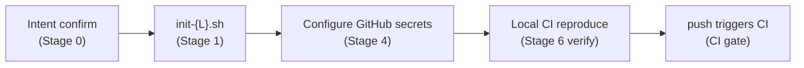

# Pangu (盘古) — Industrial-Grade Project Init Skill

[中文](README.md)

[](https://github.com/Kirky-X/pangu/releases) [](LICENSE)

Pangu is an industrial-grade project initialization skill for AI agents. It turns an empty directory into a production-grade project with **complete quality guardrails**: language scaffolding + Git + GitHub CI quality gates + tag-triggered Release workflow + local pre-commit/lefthook dual industrial checks + coverage gate (industry baseline 80%).

Covers **9 languages** + **3 multi-language hybrid forms**. Templates and scripts are pre-stored in the skill directory and copied/invoked directly — nothing is generated from scratch. See [SKILL.md](SKILL.md) for the full route table and process documentation.

## Features

### One-command init for 9 languages

| Language | init script | Package manager / build | Security tools | Coverage tools | Registry (conditional) |
| -------- | ----------- | ----------------------- | -------------- | -------------- | ---------------------- |
| Rust | init-rust.sh | cargo | cargo-audit + cargo-deny + Miri | cargo-llvm-cov / tarpaulin | crates.io |
| Python | init-python.sh | uv / pip | bandit + pip-audit + ruff | pytest-cov | PyPI |
| Node/TS | init-node.sh | pnpm / npm | eslint-plugin-security + npm audit | vitest-cov / c8 | npm |
| Java | init-java.sh | Maven / Gradle | SpotBugs+FindSecBugs + OWASP Dep-Check | JaCoCo | Maven Central |
| Go | init-go.sh | go modules | gosec + govulncheck | go test -cover + covdata | GitHub Release |
| C/C++ | init-cpp.sh | CMake + Ninja | cppcheck + flawfinder + clang-tidy | gcov + lcov / gcovr | GitHub Release |
| Ruby | init-ruby.sh | bundler | brakeman + bundler-audit | simplecov | RubyGems |
| PHP | init-php.sh | composer | psalm(security) + composer-audit | phpunit --coverage | Packagist |
| .NET | init-dotnet.sh | dotnet CLI | SecurityCodeScan + dotnet format analyzers | coverlet + reportgenerator | NuGet |

> Shared GitHub-ecosystem files (dependabot, codeql, issue/pr templates, CODEOWNERS, editorconfig) live in `templates/common/` and are used by all languages.

### 3 multi-language hybrid forms

| Form | Criterion | Script | Layout |
| ---- | --------- | ------ | ------ |
| Coexisting monorepo | Multiple languages, independent, no cross-calls | `init-multi.sh <l1,l2,...>` | Per-`<lang>/` subdirs, root shares harness |
| FFI rust→python | rust core + python binding (PyO3/maturin) | `init-rust-pyo3.sh` | rust+python **same root** |
| FFI rust→node | rust core + node binding (napi-rs) | `init-rust-napi.sh` | rust+node **same root** |

### Quality guardrails

- **Policy as code**: `.pre-commit-config.yaml` is the single source of gate truth (most complete checks); lefthook + CI mirror the core subset with unified thresholds to avoid "passes locally, red in CI"
  - **fast core** (format / lint / license-deny) → pre-commit + lefthook + CI, consistent across all three, run on every commit
  - **slow** (coverage ≥80% / security audit) → lefthook `pre-push` + CI, thresholds aligned
- **Conditional release**: Release workflow always produces GitHub Release artifacts; pushes to a registry (crates.io / PyPI / npm / Maven Central / RubyGems / Packagist / NuGet) **only when the corresponding secret exists** — no secret, no error, just skip
- **Coverage industry baseline 80%**: core business logic 85%+, utility classes 70%+

## Installation

### Method 1: Via `skills` package (recommended)

Requires [Node.js](https://nodejs.org/) 18+ and the `skills` npm package (v1.5.12+). `skills` is the CLI for the open agent skills ecosystem, supporting 68+ agents (Claude Code / Trae / Cursor / Codex / OpenCode, etc.).

```bash
# Install to Claude Code
npx skills add https://github.com/Kirky-X/pangu.git --agent claude-code -y

# Equivalent shorthand (owner/repo)
npx skills add Kirky-X/pangu --agent claude-code -y

# Install to Trae
npx skills add Kirky-X/pangu --agent trae -y

# List all discoverable skills in this repo (no install)
npx skills add https://github.com/Kirky-X/pangu.git --list
```

After installation, skill files are located in the corresponding agent's skills directory (e.g. `.claude/skills/pangu/`).

### Method 2: Traditional git clone

```bash
git clone https://github.com/Kirky-X/pangu.git
# Link or copy SKILL.md + references/ + scripts/ + templates/ to the agent skills directory
# Skills directory paths for each runtime (choose one):
#   Claude Code:  ~/.claude/skills/pangu/
#   Trae:         ~/.trae-cn/skills/pangu/
#   Cursor:       ~/.cursor/skills/pangu/
#   Codex:        ~/.codex/skills/pangu/
```

## Usage

Once loaded as a skill by an agent, Pangu is triggered by natural language intent — no explicit commands needed. Trigger phrases include "initialize project", "new project", "set up CI", "configure pre-commit", "release workflow", "project scaffold", "industrial-grade checks", etc.

```bash
# 1. Enter the target directory (empty is best)
cd /path/to/project

# 2. Invoke the one-command script for the language (self-contained: scaffolding + harness copy + git init + hook install)
bash ~/.claude/skills/pangu/scripts/init-rust.sh my-project

# Multi-language hybrid projects use dedicated scripts:
# Coexisting:        bash scripts/init-multi.sh rust,python,node my-monorepo
# FFI rust→python:   run maturin new --mixed --bindings pyo3 <name> first, then bash scripts/init-rust-pyo3.sh
# FFI rust→node:     run napi new first, then bash scripts/init-rust-napi.sh
```

Each `init-{L}.sh` does 4 things: native language scaffolding → copy `templates/common/` + `templates/{L}/` → `git init` + first stage (no auto-commit) → install local hooks (both pre-commit and lefthook; user enables one).

## Capabilities

### `references/` — Toolchain and spec references

| File | Content | When to read |
| ---- | ------- | ------------ |
| [`languages.md`](references/languages.md) | 9-language toolchain cheat sheet (with local-reproduce commands) | Stage 1 / 6 |
| [`coverage-standards.md`](references/coverage-standards.md) | Industry coverage gate standards | Configuring coverage threshold |
| [`hooks-compare.md`](references/hooks-compare.md) | pre-commit vs lefthook selection | Stage 2 |
| [`registry-secrets.md`](references/registry-secrets.md) | Per-registry secret configuration | Stage 4 |
| [`multi-language.md`](references/multi-language.md) | Multi-language project guide (decision tree + hook merge) | Hybrid projects |

### `scripts/` — One-command init scripts

| Script | Purpose |
| ------ | ------- |
| `init-rust.sh` / `init-python.sh` / `init-node.sh` / `init-java.sh` / `init-go.sh` / `init-cpp.sh` / `init-ruby.sh` / `init-php.sh` / `init-dotnet.sh` | One-command init for 9 single languages |
| `init-multi.sh` | Coexisting monorepo orchestration |
| `init-rust-pyo3.sh` | FFI rust→python (maturin/PyO3) |
| `init-rust-napi.sh` | FFI rust→node (napi-rs) |
| `install-hooks.sh` | Local hook installation |
| `_common.sh` | Common function library (sourced by each init; must read before editing scripts) |

### `templates/` — Pre-stored harness templates

```
templates/
├── common/          # Shared GitHub ecosystem (dependabot / codeql / issue-pr templates / CODEOWNERS / editorconfig / LICENSE-MIT)
└── {rust,python,node,java,go,cpp,ruby,php,dotnet}/  # Per-language CI / release / hook / config
```

## Full Pipeline



1. **Stage 0 · Intent confirm**: language / package manager / whether to publish to a registry / project path (must confirm before destructive ops)
2. **Stage 1 · Language init**: run `init-{L}.sh` for scaffolding + harness + git init + hook install
3. **Stage 2 · Local hooks**: enable either pre-commit (`pre-commit install`) or lefthook (`lefthook install`)
4. **Stage 3 · GitHub CI gate**: checkout → format → lint → security → test + coverage ≥80%; any non-zero exit blocks merge
5. **Stage 4 · Release**: triggered by pushing a `v*` tag; build artifacts → GitHub Release → conditional registry push
6. **Stage 5 · Dependency & security guardrails**: Dependabot + CodeQL + per-language SCA
7. **🛑 Stage 6 · Verify (STOP)**: local CI reproduce + hook trigger verification + file inventory + YAML syntax check

## License

MIT
