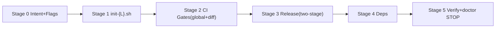

# Pangu — Project Harness Initialization Skill

> Turns an empty directory into a fully-guarded project: language scaffolding + Git + GitHub CI quality gates + tag-triggered Release publishing + local pre-commit/lefthook dual checks + dual coverage gates (global + diff coverage).

[](https://github.com/Kirky-X/pangu/releases) [](https://github.com/Kirky-X/pangu/releases) [](LICENSE)

English | [中文](README.md)

## ✨ Features

- **One-command init for 9 languages**: Rust / Python / Node / Java / Go / C++ / Ruby / PHP / .NET, each with dedicated CI templates, Release workflows, security scanners (cargo-audit, bandit, gosec, OWASP Dep-Check, etc.), and coverage tooling.
- **3 hybrid forms**: coexisting monorepo (`init-multi.sh`), FFI rust→python (`init-rust-pyo3.sh`), FFI rust→node (`init-rust-napi.sh`).
- **10th project type — skill repos themselves**: `init-skill.sh` scaffolds a standard skill repo; `align-skill.sh` aligns existing skills (`--dry-run`/`--fix`); `bump-skill-version.sh` propagates version bumps.
- **Policy as code**: `.pre-commit-config.yaml` is the single source of gate truth; lefthook + CI mirror the core subset with unified thresholds (fast core: format/lint/license-deny; slow: coverage global+diff gates + security audit → lefthook pre-push + CI, equivalent across all 9 languages, guarded by smoke tests).
- **Diff coverage dual gate**: beyond the global threshold, newly added/modified lines relative to the base branch must meet the same threshold (diff-cover wired for 7 languages; Go/Ruby global-only for now, upgrade paths in coverage-standards) — new code at 0% can no longer ride on legacy coverage.
- **Parameterized thresholds**: init supports `--cov <N>` / `--profile core|tool` (core logic 85 / utility 70) / `--branch` / `--no-release` / `--no-codeql` / `--changelog release-please`; thresholds and branch render into CI/lefthook/tool-config in one pass, consistent by construction.
- **Two-stage release**: a `verify` job runs first on `v*` tags (tag format + tag↔version-manifest consistency); a wrong tag never reaches the build. rust/go/cpp/php artifacts ship with checksums.txt, npm publish uses provenance (attestation/cosign hardening in registry-secrets).
- **Traceable provenance**: init writes `.pangu-meta.yml` (pangu version/params/harness file list) so template upgrades can be diffed against the matching tag; `doctor.sh` health-checks generated projects.
- **Coverage gates are real**: threshold checks hard-fail, never neutralized by `|| true`; uploads go through the official `codecov-action@v4`; cpp gets a 3-OS build matrix plus a dedicated coverage job; php/dotnet CI gained dependency caching (the cpp template has none).
- **SHA-pinned own CI**: pangu's own workflows reference all third-party actions by commit SHA.
- **Dependency guardrails**: Dependabot + CodeQL (trimmable via `--no-codeql`) + per-language SCA.

## 📦 Installation

```bash
# Option 1: install into a project's agent directory (install-skill.sh has 7 subcommands, 9 agents supported)
bash scripts/install-skill.sh install pangu --target /path/to/project --agent claude

# Option 2: manual copy into the ZCode skills directory
cp -r /path/to/pangu ~/.zcode/skills/pangu

# Option 3: remote install from GitHub
npx skills add Kirky-X/pangu --agent claude-code -y
```

## 🚀 Quick Start

Prerequisites: the target language toolchain (e.g. `uv` for Python, `cargo` for Rust); `$SKILL` is the skill install directory (e.g. `~/.zcode/skills/pangu`).

```bash
cd /path/to/project   # An empty dir works best; running init in an existing project overwrites some config — confirm first

# Language init (self-contained: native scaffold + harness templates + placeholder rendering + .pangu-meta + git init + local hooks)
bash "$SKILL/scripts/init-python.sh" my-project
bash "$SKILL/scripts/init-rust.sh" my-project --profile core   # core-logic threshold 85
bash "$SKILL/scripts/init-go.sh" my-project --branch master --no-codeql

# Hybrid projects
bash "$SKILL/scripts/init-multi.sh" rust,python,node my-monorepo   # coexisting monorepo
# FFI: run maturin new --mixed --bindings pyo3 <name> (or napi new) first, then init-rust-pyo3.sh / init-rust-napi.sh

# Skill-repo init (meta mode)
bash "$SKILL/scripts/init-skill.sh" my-skill --cn-name 我的技能
```

After init, follow the printed next steps: enable a local hook (`pre-commit install` / `lefthook install` / `prek install`, pick one — configs are generated) → reproduce CI commands locally until green (including diff coverage) → configure publish secrets (optional) → push to trigger CI / push a `v*` tag to trigger Release. Health-check the generated project: `bash "$SKILL/scripts/doctor.sh" "$(pwd)"`.


```mermaid
flowchart LR
    A["Stage 0 Intent+Flags"] --> B["Stage 1 init-{L}.sh"] --> C["Stage 2 CI Gates(global+diff)"] --> D["Stage 3 Release(two-stage)"] --> E["Stage 4 Deps"] --> F["Stage 5 Verify+doctor STOP"]
```

## ✅ Tests & Verification

Verified 2026-10-04 (v0.1.6, unreleased workspace version):

- **Self-check gate**: `bash scripts/selfcheck.sh` passes in full — shellcheck on 22 scripts with 0 errors, YAML lint on 42 template files, template integrity for the 9 language dirs (the skill/common inventories live in the repo's own CI integrity job), SKILL.md index validation (72 referenced paths, fail-closed), and the init smoke suite.
- **Init smoke suite** (`scripts/smoke-test.sh`, templates-only end-to-end): 9 languages × default params (required files present / zero placeholder residue / YAML parseable / git initialized / lefthook equivalence baseline / no snippet leftovers) + parameterization assertions (`--cov 90 --branch trunk --no-release --no-codeql` renders and trims correctly) — all green.
- **doctor verified**: `scripts/doctor.sh` passes against a fresh smoke project (files/YAML/hooks/gates/provenance).
- **pytest regression suite**: `python3 -m pytest tests/ -q` — all 122 tests pass (per-language init / multi-language / FFI / skill repos / align / bump / install-skill / selfcheck behavior).
- **Multi-language prefix & lint**: `bash scripts/test-multi.sh` ALL GREEN (copy_lang prefix); `python3 scripts/skill_lint.py .` reports 0 fail / 0 warn.
- **Eval assets**: `evals/evals.json` with 3 evals + `test-prompts.json` with 5 trigger prompts; `hooks/pre-push` is this repo's own cleanup hook (git gc + cargo clean before push).
- pangu's own CI (`.github/workflows/ci.yml`) pins every action by commit SHA, with lint / integrity / smoke jobs.

## 📁 Directory Structure

```
pangu/
├── SKILL.md            # Route table + 5-stage flow + failure handling
├── skill.json
├── test-prompts.json   # 5 trigger-test prompts
├── scripts/            # 22 scripts
│   ├── init-{rust,python,node,java,go,cpp,ruby,php,dotnet}.sh
│   ├── init-multi.sh / init-rust-pyo3.sh / init-rust-napi.sh
│   ├── init-skill.sh / align-skill.sh / bump-skill-version.sh
│   ├── install-hooks.sh / _common.sh / selfcheck.sh
│   ├── smoke-test.sh / doctor.sh / test-multi.sh
│   ├── install-skill.sh / skill_lint.py
│   └── kb/tests/           # 6 focused regression scripts
├── templates/          # 11 template dirs
│   ├── common/             # dependabot / codeql / issue-pr templates / CODEOWNERS / release-please(opt-in)
│   ├── {rust,…,dotnet}/    # per-language CI(global+diff coverage) / release(verify two-stage) / hook configs
│   └── skill/              # skill-repo templates (9 .template files)
├── references/         # 7 references (languages / coverage-standards / hooks-compare / registry-secrets / multi-language / skill-release / build-optimization)
├── hooks/              # repo-own pre-push cleanup (git gc + cargo clean)
├── tests/              # pytest suite (122 tests)
└── evals/              # evals.json (3 evals)
```

## 🔮 Boundaries

- **Does not trigger**: adding a single hook or editing one CI step (edit the file directly); localized changes to a mature project; generating only a `.gitignore`; the user explicitly wanting a single artifact (e.g. "just give me a release.yml").
- **Sibling skills**: pangu covers 0-to-1 initialization; `specmark` manages the change process afterwards; `tiangang` runs security scans (CI security tooling is pre-wired by pangu, day-to-day scanning belongs to tiangang); `diting` handles code quality review.

## 📄 License & Attribution

MIT License. Author Kirky-X, repo [Kirky-X/pangu](https://github.com/Kirky-X/pangu).
