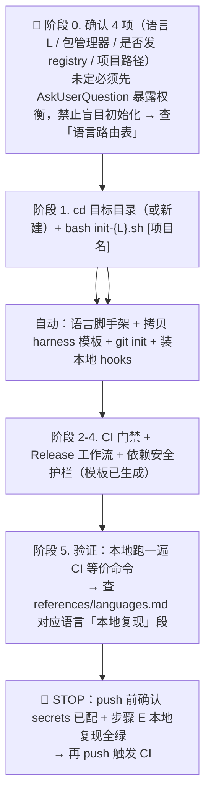

# Env Init · 工业级项目初始化

把一个空目录变成带**完整质量护栏**的生产级项目：语言脚手架 + Git + GitHub CI 门禁 + tag 触发的 Release 发布 + 本地 commit 前工业级检查 + 覆盖率门禁。

## TL;DR · 60 秒执行


```mermaid
flowchart TD
    A["🔴 阶段 0. 确认 4 项（语言 L / 包管理器 / 是否发 registry / 项目路径）<br/>未定必须先 AskUserQuestion 暴露权衡，禁止盲目初始化 → 查「语言路由表」"]
    B["阶段 1. cd 目标目录（或新建）+ bash init-{L}.sh [项目名]"]
    C["自动：语言脚手架 + 拷贝 harness 模板 + git init + 装本地 hooks"]
    D["阶段 2-4. CI 门禁 + Release 工作流 + 依赖安全护栏（模板已生成）"]
    E["阶段 5. 验证：本地跑一遍 CI 等价命令<br/>→ 查 references/languages.md 对应语言「本地复现」段"]
    F["🛑 STOP：push 前确认 secrets 已配 + 步骤 E 本地复现全绿<br/>→ 再 push 触发 CI"]
    A --> B --> C --> D --> E --> F
    B --> C
```

## 核心原则

1. **预存资产优先** — 所有 CI/release/hook/配置均为本 skill 目录下的**预存模板与脚本**，直接复制/调用，不凭空生成。改命令前先读 `references/`。
2. **门禁即代码** — `.pre-commit-config.yaml` 为门禁单一来源（检查项最全），lefthook + CI 镜核心子集，阈值统一避免「本地过、CI 红」：
   - **fast 核心**（格式 / lint / license-deny）→ pre-commit + lefthook + CI 三处一致，每次提交即跑
   - **fast 辅助**（私钥扫描 / 拼写 / 大文件 / 尾随空格）→ pre-commit 最全；lefthook 镜私钥扫描（9 语言全部）；CI 不重复（本地拦截优先，CI 专注核心 + slow）
   - **slow**（覆盖率全局+diff 双门禁 / 安全审计）→ lefthook `pre-push`（9 语言全部）+ CI，阈值一致；pre-commit framework 无 push 钩子，由 CI 兜底。等价性由 `scripts/selfcheck.sh` 冒烟断言守护
3. **条件发布** — Release 工作流默认产出 GitHub Release 产物；**仅当对应 secret 存在**时才推 registry（crates.io / PyPI / npm / RubyGems / NuGet）；java 默认发 GitHub Packages（自动 `GITHUB_TOKEN`，无需配置）；Packagist 无 API，git tag webhook 自动同步。无 secret 不报错，只跳过。tag 打错/版本不一致在首个 `verify` job 失败，不进入构建发布（两段式）。
4. **覆盖率行业底线 80%** — 核心业务逻辑 85%+（`--profile core`），工具类 70%+（`--profile tool`），或 `--cov <N>` 自定。阈值渲染进 CI/lefthook/工具配置三处（`__PANGU_COV__` 占位符）。**diff coverage 双门禁**：全局覆盖率之外，对相对基线分支的新增/修改行同样设阈值（Go/Ruby 暂仅全局，升级路径见 `references/coverage-standards.md`）。
5. **不臆测未读脚本** — 调用 `scripts/init-{L}.sh` 前先 Read 它，确认行为与用户需求一致；不盲目 `bash` 未知脚本。

---

## 语言路由表

| 语言        | init 脚本        | 包管理/构建          | CI 模板         | Release 模板         | 安全工具                                   | 覆盖率工具                 | 发布 registry（条件）                 |
| ----------- | ---------------- | -------------------- | --------------- | -------------------- | ------------------------------------------ | -------------------------- | ------------------------------------- |
| **Rust**    | `init-rust.sh`   | cargo                | `rust/ci.yml`   | `rust/release.yml`   | cargo-audit + cargo-deny（Miri 手动 nightly） | cargo-llvm-cov / tarpaulin | crates.io（CARGO_REGISTRY_TOKEN）     |
| **Python**  | `init-python.sh` | uv（首选）/pip       | `python/ci.yml` | `python/release.yml` | bandit + pip-audit + ruff                  | pytest-cov                 | PyPI（UV_PUBLISH_TOKEN）              |
| **Node/TS** | `init-node.sh`   | pnpm（首选）/npm     | `node/ci.yml`   | `node/release.yml`   | eslint-plugin-security + pnpm audit        | vitest-cov / c8            | npm（NPM_TOKEN）                      |
| **Java**    | `init-java.sh`   | Maven（默认）/Gradle | `java/ci.yml`   | `java/release.yml`   | SpotBugs+FindSecBugs + OWASP Dep-Check     | JaCoCo                     | GitHub Packages（自动 GITHUB_TOKEN）  |
| **Go**      | `init-go.sh`     | go modules           | `go/ci.yml`     | `go/release.yml`     | gosec + govulncheck                        | go tool cover -func（阈值比对） | GitHub Release（Go 无中心 registry） |
| **C/C++**   | `init-cpp.sh`    | CMake + Ninja        | `cpp/ci.yml`    | `cpp/release.yml`    | cppcheck + flawfinder + clang-tidy（pre-commit） | gcovr（gcov 后端）    | GitHub Release                        |
| **Ruby**    | `init-ruby.sh`   | bundler              | `ruby/ci.yml`   | `ruby/release.yml`   | brakeman + bundler-audit                   | simplecov                  | RubyGems（RUBYGEMS_API_KEY）          |
| **PHP**     | `init-php.sh`    | composer             | `php/ci.yml`    | `php/release.yml`    | psalm(security) + composer-audit           | phpunit --coverage         | Packagist（无 API，git tag 触发）     |
| **.NET**    | `init-dotnet.sh` | dotnet CLI           | `dotnet/ci.yml` | `dotnet/release.yml` | SecurityCodeScan + dotnet format analyzers | coverlet + reportgenerator | NuGet（NUGET_API_KEY）                |

> 通用 GitHub 生态文件（dependabot、codeql、issue/pr 模板、CODEOWNERS、editorconfig）在 `templates/common/`，所有语言共享。

---

## Skill 仓库初始化（meta 模式）

pangu 不只初始化代码项目，还能初始化 **skill 仓库本身**（遵循标准 skill 模板结构）。这是 pangu 的第 10 种项目类型。

### 一键初始化新 skill 仓库

```bash
bash <skill>/scripts/init-skill.sh <skill-name> [--cn-name <中文名>] [--author <作者>] [--description <描述>] [--target-dir <目录>]
```

行为：创建目录结构 → 渲染模板（.gitignore/LICENSE/skill.json/.claude-plugin/README.md/README_EN.md/test-prompts.json/SKILL.md 骨架）→ git init + stage → 打印 next steps。

### 存量 skill 对齐标准模板

```bash
bash <skill>/scripts/align-skill.sh <skill-dir> [--dry-run] [--fix]
```

- `--dry-run`（默认）：检查报告，不修改
- `--fix`：补齐缺失文件、优化 .gitignore

检查清单：8 个必备文件 + .gitignore 关键忽略项 + skill.json 8 字段 + LICENSE 类型。

### Skill 仓库模板资产

| 资产 | 路径 | 用途 |
| --- | --- | --- |
| 模板根 | `templates/skill/` | 9 个 .template 文件 |
| 初始化脚本 | `scripts/init-skill.sh` | 新建 skill 仓库 |
| 对齐脚本 | `scripts/align-skill.sh` | 存量 skill 渐进式对齐 |

---

## Skill 仓库发版（命令式 SOP）

init-skill.sh 完成 skill 仓库初始化后，发版时按 `references/skill-release.md` 6 步骤 SOP 执行：set version → propagate → changelog → validate → commit & push → tag & publish。版本号传播用 `scripts/bump-skill-version.sh <v>` 自动同步所有 manifest + README badge，与 `templates/skill/.github/workflows/release.yml.template` 的 tag 触发 CI 自动化互补。

| 资产 | 路径 | 用途 |
| --- | --- | --- |
| 发版 SOP | `references/skill-release.md` | 6 步骤命令式流程 |
| 版本号传播脚本 | `scripts/bump-skill-version.sh` | 同步 manifest version + README badge |

---

## 混合项目路由（多语言）

单语言走上表 `init-{L}.sh`。项目含多于一种语言时按形态选：

| 形态            | 判定                                    | 脚本                        | 布局                                |
| --------------- | --------------------------------------- | --------------------------- | ----------------------------------- |
| 并存型 monorepo | 多语言各自独立、互不调用                | `init-multi.sh <l1,l2,...>` | 各 `<lang>/` 子目录，根共享 harness |
| FFI rust→python | rust 核心 + python 绑定（PyO3/maturin） | `init-rust-pyo3.sh`         | rust+python **同根**                |
| FFI rust→node   | rust 核心 + node 绑定（napi-rs）        | `init-rust-napi.sh`         | rust+node **同根**                  |

决策树、hook 合并手动步骤、CI 命名见 `references/multi-language.md`。FFI 脚本半自动（官方工具管骨架，本 skill 管 harness）：先跑 `maturin new --mixed --bindings pyo3` / `napi new`，再跑对应 init 脚本叠加 harness。

---

## 分阶段执行流程

### 🔴 阶段 0 · 意图确认（必做 · CHECKPOINT）

复述给用户：语言、包管理器偏好、是否发 registry、项目路径。**🛑 破坏性操作（在已有项目目录跑 init 会覆盖 .gitignore/CI 文件）前必须确认**；空目录可直接执行。语言/包管理器未定 → 必须先 AskUserQuestion 暴露权衡，禁止替用户拍板。

可选 harness 旗标（按需求向用户确认后追加到 init 命令）：

| 旗标 | 作用 | 默认 |
| --- | --- | --- |
| `--cov <N>` | 覆盖率门禁阈值（10-99） | 80 |
| `--profile core\|tool` | 分级预设：核心业务 85 / 工具类 70 | 80 |
| `--branch <name>` | 默认分支（CI 触发 + diff coverage 基线） | main |
| `--no-release` | 不生成 release.yml | 生成 |
| `--no-codeql` | 不生成 codeql.yml | 生成 |
| `--changelog release-please` | 附加 Release PR 自动维护 CHANGELOG（前提：commit 语义合规） | 人工维护 |
| `--templates-only` | 只拷 harness 模板，跳过脚手架与依赖安装（存量项目叠加/冒烟测试） | 完整初始化 |

### 阶段 1 · 语言初始化

```bash
cd /path/to/project
bash "$SKILL/scripts/init-rust.sh" my-project                # 最简
bash "$SKILL/scripts/init-rust.sh" my-project --profile core # 核心业务阈值 85
bash "$SKILL/scripts/init-rust.sh" my-project lib --no-codeql --branch master
```

脚本自包含：语言原生脚手架 + 拷贝 harness 模板（`templates/common/` + `templates/{L}/`）+ 渲染占位符（阈值/分支）+ 写 `.pangu-meta.yml` 生成来源记录 + git init + 装本地 hooks（pre-commit framework + lefthook 双产出，择一启用，详见 `references/hooks-compare.md`）。多语言混合项目走专属脚本（见上方「混合项目路由」），用法与前置步骤见各脚本头部注释。

### 阶段 2 · GitHub CI 质量门禁

`.github/workflows/ci.yml` 在每个 PR/push 时跑等价本地 hook + 覆盖率双门禁：`checkout(fetch-depth:0) → toolchain → 依赖(缓存；python/cpp 模板无缓存) → 格式 → lint → 安全扫描 → 测试 + 全局覆盖率(≥阈值) + diff 覆盖率(变更行 ≥阈值) → 上传覆盖率报告`。任一步非零退出码 = 阻断合并。cpp 模板为三平台构建矩阵 + 独立 linux 覆盖率 job。

### 阶段 3 · Release 发布工作流

`.github/workflows/release.yml` 由 `v*` tag 触发，两段式：**verify job 先行**（tag 格式 + tag↔版本 manifest 一致性，rust/python/node/java/cpp/ruby 校验版本文件；go/php/dotnet 无版本 manifest，校验 tag 规范）→ 构建 → 创建 GitHub Release（无条件；rust/go/cpp/php 附 checksums.txt）→ 若对应 secret 存在则发布到 registry（crates.io / PyPI / npm(--provenance) / RubyGems / NuGet；java 发 GitHub Packages，用自动 `GITHUB_TOKEN`），无 secret 跳过不报错。Secret 清单见 `references/registry-secrets.md`（含产物签名/attestation 加固）。`--changelog release-please` 时另有 `release-please.yml` 自动维护 CHANGELOG.md。

### 阶段 4 · 依赖与安全护栏

- **Dependabot**（`.github/dependabot.yml`）：依赖与 GitHub Actions 版本自动升级 PR
- **CodeQL**（`.github/workflows/codeql.yml`）：语义级漏洞扫描（`--no-codeql` 可裁剪）
- 各语言另有专属 SCA（cargo-audit / pip-audit / pnpm audit / OWASP Dep-Check / govulncheck / bundler-audit / composer audit / dotnet list --vulnerable）

### 🛑 阶段 5 · 验证（标记完成前必做 · STOP）

1. **本地复现 CI**：按 `references/languages.md` 对应语言「本地复现」段手动跑一遍 CI 等价命令（含 diff coverage），全绿
2. **hook 触发验证**：做一次小改动 `git commit`，确认 pre-commit/lefthook 真的拦截了故意引入的格式错误
3. **文件清点**：`ls .github/workflows/` 应有 `ci.yml release.yml`（按参数可能另有 `release-please.yml`，或无 release.yml/codeql.yml）；根目录应有 `.pre-commit-config.yaml lefthook.yml .editorconfig .gitignore .pangu-meta.yml`
4. **YAML 语法**：`python3 -c "import yaml,glob;[yaml.safe_load(open(f)) for f in glob.glob('**/*.y*ml',recursive=True)]"` 无异常
5. **一键体检**：`bash "$SKILL/scripts/doctor.sh" "$(pwd)"` 全绿（文件/YAML/hooks/门禁/来源记录）

---

## 常见失败处置

执行 init 或 hook 时遇以下症状，按「一线修复」处理；仍失败用「兜底」。覆盖 9 语言共性失败：

| 症状                                                      | 一线修复                                                                                   | 兜底                                                         |
| --------------------------------------------------------- | ------------------------------------------------------------------------------------------ | ------------------------------------------------------------ |
| `cargo llvm-cov` / `cargo-audit` / `cargo-deny` not found | `cargo install cargo-llvm-cov cargo-audit cargo-deny`                                      | 注释 `lefthook.yml` / `.pre-commit-config.yaml` 对应 hook，CI 兜底 |
| `diff-cover` not found（pre-push）                        | `pip install diff-cover` 后把 `uvx diff-cover` 改为 `diff-cover`；或 `uv tool install uv`  | 注释 lefthook pre-push 的 coverage 命令，CI 兜底              |
| `uvx: command not found`（CI diff coverage 步骤）        | setup-uv 已在 coverage job 预置；本地装 `uv`（`curl -LsSf https://astral.sh/uv/install.sh \| sh`） | 极端环境改 `pip install diff-cover` 后把 uvx 改 diff-cover    |
| release `verify` job 报 tag 与版本 manifest 不一致        | 以 tag 为准 bump 版本文件（Cargo.toml/pyproject/package.json/pom/gemspec/CMakeLists）后重打 tag | 属预期拦截，不是故障——两段式设计目的即此                      |
| `cargo deny check` 报无 config                            | `cargo deny init` 生成 deny.toml                                                           | 删 deny hook，CI cargo-deny-action 兜底                       |
| pre-commit 报 `cargo / python not found`                  | 装工具链（rustup / python），重跑 `pre-commit run --all-files`                             | 切 lefthook 或 [prek](https://github.com/j178/prek)（自动托管工具链） |
| CI coverage 红（低于阈值）                                | 本地复现等价命令（`references/languages.md` 「本地复现」段），注意 diff 与全局两道门禁     | 工具类降至 70%（`--profile tool` 渲染，见 `coverage-standards.md`） |
| diff coverage 红（全局达标但变更行未覆盖）                | 为本次改动补测试——这是门禁设计目的，不是误报                                               | 无（不允许豁免；历史债用 feature 分支渐进还）                 |
| `lefthook install` 报未安装                               | `brew install lefthook` 或 `npm i -g @evilmartians/lefthook`                               | 切 pre-commit 或 prek                                         |
| node `pnpm add` 报 store 权限                             | `pnpm config set store-dir ~/.local/share/pnpm/store`                                      | 手动 `pnpm install` 后重跑 `init-node.sh`                     |
| 多语言 `ci.yml` 被次语言覆盖                              | 用 `init-multi.sh`（次语言自动 `{lang}-ci.yml` 前缀）；手动并存按 `multi-language.md` 改名 | 手动把后拷语言 `ci.yml`→`{lang}-ci.yml`                       |
| hook 片段合并遗漏（次语言检查没跑）                       | 按 `references/multi-language.md`「hook 合并」逐条核对并去重（含 pre-push 改名追加）       | 暂保留片段文件，CI 各 `{lang}-ci.yml` 兜底                    |
| `init-rust-pyo3.sh` / `init-rust-napi.sh` 报脚手架未就位  | 先跑 `maturin new --mixed --bindings pyo3 <name>` / `napi new`，再重跑本脚本               | 确认同根有 `Cargo.toml` + `pyproject.toml`/`package.json`     |

---

## Do NOT 触发本 skill 的场景

- 单纯加一个 hook / 改一条 CI 步骤 → 直接编辑对应文件，不必跑全套初始化。
- 已有成熟项目的局部改造 → 用 `everything-claude-code:hookify-configure` 等专项工具。
- 仅生成 `.gitignore` → 直接写，不必套 harness。
- 用户明确只要某一种产物（如"只给我个 release.yml"）→ 直接给该模板，不跑全流程。

## 参考资产索引

| 资产                               | 路径                                                               | 何时读         |
| ---------------------------------- | ------------------------------------------------------------------ | -------------- |
| 9 语言工具链速查（含本地复现命令） | `references/languages.md`                                          | 阶段 1/6       |
| 行业覆盖率门禁标准（含 diff coverage 落地矩阵） | `references/coverage-standards.md`                                 | 配置覆盖率阈值 |
| 生成项目编译优化配置（高 ROI 默认落地项） | `references/build-optimization.md`                                 | 改编译优化模板 |
| pre-commit vs lefthook vs prek 选型 | `references/hooks-compare.md`                                      | 阶段 2         |
| 各 registry secret + 产物完整性加固 | `references/registry-secrets.md`                                   | 阶段 4         |
| 公共函数库（被各 init source）     | `scripts/_common.sh`                                               | 改脚本前必读   |
| 一键初始化脚本                     | `scripts/init-{L}.sh`                                              | 阶段 1         |
| 本地 hook 安装                     | `scripts/install-hooks.sh`                                         | 阶段 2         |
| 已生成项目诊断（doctor）           | `scripts/doctor.sh`                                                | 阶段 5 / 排障  |
| init 冒烟测试（9 语言端到端）      | `scripts/smoke-test.sh`                                            | 改模板/脚本后  |
| skill 安装/管理（install/update/uninstall/list-skills/list-agents/status/generate-commands，9 种 agent） | `scripts/install-skill.sh` | 部署 skill 到项目 agent 目录 |
| pytest 回归套件（122 用例）        | `tests/`                                                           | 改脚本/模板后  |
| skill 评测集（3 evals / 5 prompts） | `evals/evals.json` / `test-prompts.json`                          | 改触发词/输出约定后 |
| release-please 可选模板（opt-in）  | `templates/common/release-please.yml`                              | `--changelog release-please` |
| 模板根                             | `templates/{common,rust,python,node,java,go,cpp,ruby,php,dotnet}/` | 所有阶段       |
| 多语言项目指引（决策树+hook 合并） | `references/multi-language.md`                                     | 混合项目       |
| 并存型 monorepo 编排               | `scripts/init-multi.sh`                                            | 混合项目       |
| FFI rust→python（maturin/PyO3）    | `scripts/init-rust-pyo3.sh`                                        | 混合项目       |
| FFI rust→node（napi-rs）           | `scripts/init-rust-napi.sh`                                        | 混合项目       |
