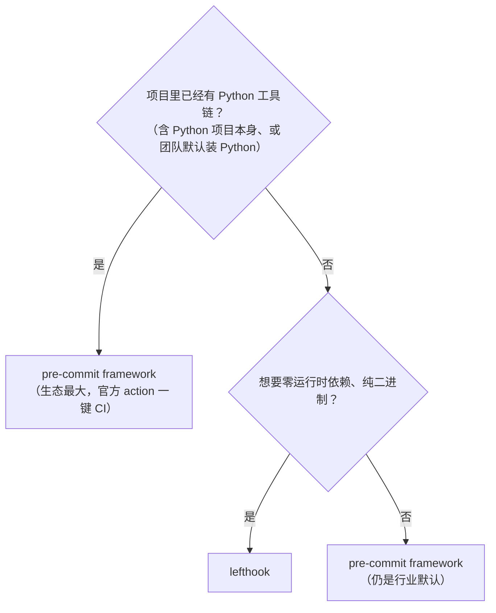

# pre-commit framework vs lefthook 选型

本 skill 对每种语言**同时产出** `.pre-commit-config.yaml` 和 `lefthook.yml`，两者检查项**完全等价**。用户择一启用。本文档给出选型依据。

## 对比

| 维度                         | pre-commit framework                                 | lefthook                                                                       |
| ---------------------------- | ---------------------------------------------------- | ------------------------------------------------------------------------------ |
| 实现                         | Python                                               | Go（单二进制）                                                                 |
| 运行时依赖                   | 需 Python 3.9+                                       | 无（静态二进制）                                                               |
| 安装                         | `uv tool install pre-commit` / `brew install pre-commit` | `brew install lefthook` / `go install ...` / `npm i -g @evilmartians/lefthook` |
| 配置文件                     | `.pre-commit-config.yaml`                            | `lefthook.yml`                                                                 |
| 并行执行                     | 部分支持（`require_serial` 控制）                    | 原生并行，快                                                                   |
| 生态/现成 hook               | 极大（pre-commit.com hooks 仓）                      | 中（自带 + 自定义脚本）                                                        |
| 跨语言一致性                 | 强（同一框架调度所有语言）                           | 强                                                                             |
| 与 GitHub Actions 集成       | 官方 `pre-commit/action`                             | 需手动调 `lefthook run`                                                        |
| 学习曲线                     | 低（声明式 repo + rev + hooks）                      | 低（YAML 树）                                                                  |
| 纯 Rust/Go 项目（无 Python） | 引入 Python 依赖                                     | 更轻                                                                           |

## 决策树



**默认推荐：pre-commit framework**（除非是纯 Rust/Go 且抗拒装 Python）。

## 安装与启用

### pre-commit

```bash
# 安装（任选其一）
uv tool install pre-commit
brew install pre-commit

# 启用（把 hook 写进 .git/hooks/pre-commit）
pre-commit install

# 首次跑全仓
pre-commit run --all-files

# CI 里跑（GitHub Actions）
# uses: pre-commit/action@v3.0.1
```

### lefthook

```bash
# 安装（任选其一）
brew install lefthook
go install github.com/evilmartians/lefthook@latest
npm i -g @evilmartians/lefthook

# 启用
lefthook install

# 跑全仓
lefthook run pre-commit --all-files
```

## 等价 hook 清单（每语言两者都对齐这套）

| 阶段                     | 检查内容                                                                                                           | 备注                                                   |
| ------------------------ | ------------------------------------------------------------------------------------------------------------------ | ------------------------------------------------------ |
| 格式                     | `cargo fmt`/`ruff format`/`prettier`/`spotless`/`gofmt`/`clang-format`/`rubocop -A`/`php-cs-fixer`/`dotnet format` | --check 模式，未格式化即失败                           |
| Lint                     | clippy/ruff/eslint/checkstyle/golangci-lint/cppcheck/rubocop/psalm/dotnet analyzers                                | `-D warnings` 等价                                     |
| 安全（轻量、可本地跑）   | bandit/gosec/cppcheck/flawfinder/brakeman 等本地秒级工具                                                           | 重型 SCA（cargo-audit/pip-audit/OWASP）放 CI，本地可选 |
| 私钥/大文件/合并冲突标记 | `gitleaks`、`check-added-large-files`、`check-merge-conflict`                                                      | pre-commit 生态现成 hook                               |
| 拼写                     | `typos`（crate）                                                                                                   | 跨语言通用                                             |
| 提交信息                 | conventional commits 校验（`commitizen`/`lefthook commit-msg`）                                                    | 可选                                                   |

> 完整覆盖率/测试**不**放 pre-commit（太慢，阻commit）。测试 + 覆盖率门禁在 CI 跑；本地若要 pre-push 跑测试，用单独的 `pre-push` hook 阶段（lefthook）或 `stages: [pre-push]`（pre-commit）。

## 同时装两套会冲突吗？

不会。两者各自往 `.git/hooks/pre-commit` 写 wrapper。**只能启用其一**：

- `pre-commit install` 会覆盖 `.git/hooks/pre-commit`
- `lefthook install` 同样覆盖

切换：先 `pre-commit uninstall`（或 `lefthook uninstall`）再装另一套。配置文件（`.pre-commit-config.yaml` / `lefthook.yml`）两份都留着不冲突，是声明文件，谁装谁读。
