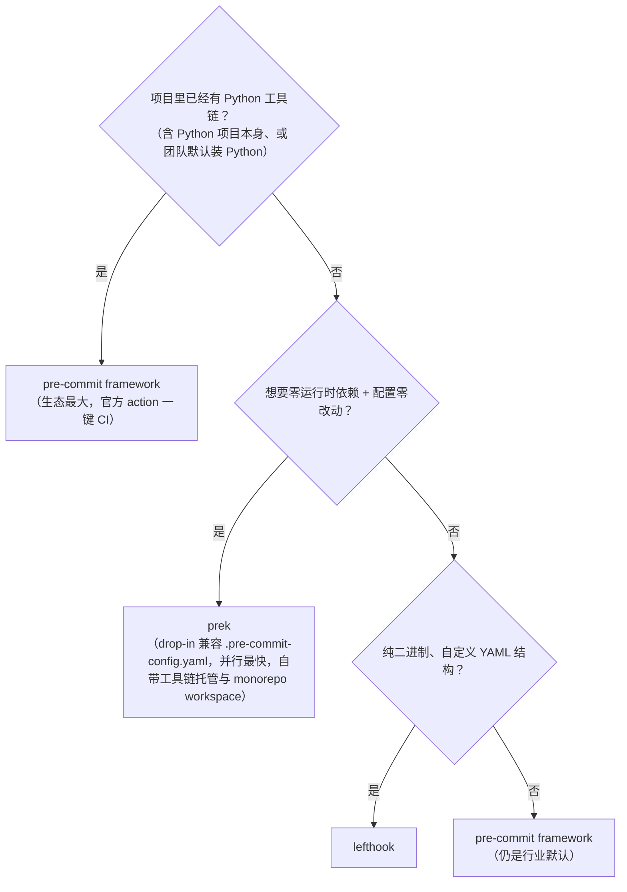

# pre-commit framework vs lefthook（vs prek）选型

本 skill 对每种语言**同时产出** `.pre-commit-config.yaml` 和 `lefthook.yml`，两者检查项**完全等价**（含 `no-private-key` 与 `pre-push` 慢检查——覆盖率全局+diff 门禁、依赖审计；自检由 `scripts/selfcheck.sh` 的冒烟断言兜底）。用户择一启用。本文档给出选型依据。

## 对比

| 维度                         | pre-commit framework                                 | lefthook                                                                       | prek                                                                            |
| ---------------------------- | ---------------------------------------------------- | ------------------------------------------------------------------------------ | ------------------------------------------------------------------------------- |
| 实现                         | Python                                               | Go（单二进制）                                                                 | Rust（单二进制）                                                                |
| 运行时依赖                   | 需 Python 3.9+                                       | 无（静态二进制）                                                               | 无（静态二进制）                                                                |
| 安装                         | `uv tool install pre-commit` / `brew install pre-commit` | `brew install lefthook` / `go install ...` / `npm i -g @evilmartians/lefthook` | 见 [j178/prek](https://github.com/j178/prek) README（brew/curl/pipx 等多通道） |
| 配置文件                     | `.pre-commit-config.yaml`                            | `lefthook.yml`                                                                 | `.pre-commit-config.yaml`（drop-in 兼容，零改动）                               |
| 并行执行                     | 部分支持（`require_serial` 控制）                    | 原生并行，快                                                                   | 原生并行（克隆/环境安装/hook 三层并行），最快                                   |
| 生态/现成 hook               | 极大（pre-commit.com hooks 仓）                      | 中（自带 + 自定义脚本）                                                        | 复用 pre-commit 全部生态 + 内置 Rust 快路径（常用 pre-commit-hooks 免装环境）   |
| 跨语言一致性                 | 强（同一框架调度所有语言）                           | 强                                                                             | 强                                                                              |
| monorepo                     | 手动（每子项目一份配置）                             | 手动                                                                           | 内置 workspace 模式（多配置一条命令全量跑）                                     |
| rev 供应链                   | 静态写 rev，靠人工更新                               | 同左                                                                           | `prek update` 冻结为 commit SHA + impostor-commit 校验 + 工具链 checksum 校验   |
| 工具链管理                   | 各 hook 自建环境                                     | 依赖本机已装                                                                   | 自动托管安装 Python/Node/Go/Rust/Ruby 等工具链（缓解「xxx not found」类失败）   |
| 与 GitHub Actions 集成       | 官方 `pre-commit/action`                             | 需手动调 `lefthook run`                                                        | 同 pre-commit（配置兼容，可换用 prek 官方 action）                              |
| 学习曲线                     | 低（声明式 repo + rev + hooks）                      | 低（YAML 树）                                                                  | 低（与 pre-commit 相同）                                                        |
| 纯 Rust/Go 项目（无 Python） | 引入 Python 依赖                                     | 更轻                                                                           | 更轻且无需改配置                                                                |

## 决策树


```mermaid
flowchart TD
    A{"项目里已经有 Python 工具链？<br/>（含 Python 项目本身、或团队默认装 Python）"}
    B["pre-commit framework<br/>（生态最大，官方 action 一键 CI）"]
    C{"想要零运行时依赖 + 配置零改动？"}
    D["prek<br/>（drop-in 兼容 .pre-commit-config.yaml，并行最快，自带工具链托管与 monorepo workspace）"]
    E{"纯二进制、自定义 YAML 结构？"}
    F["lefthook"]
    G["pre-commit framework<br/>（仍是行业默认）"]
    A -->|"是"| B
    A -->|"否"| C
    C -->|"是"| D
    C -->|"否"| E
    E -->|"是"| F
    E -->|"否"| G
```

**默认推荐：pre-commit framework**（生态与 CI 集成最成熟）；追求速度/工具链自动化/monorepo 时**推荐 prek**（配置无需任何改动，python/cpython、apache/airflow、fastapi、getsentry 等在用）。

## 安装与启用

### pre-commit

```bash
# 安装（任选其一）
uv tool install pre-commit
brew install pre-commit

# 启用（把 hook 写进 .git/hooks/pre-commit）
pre-commit install

# 首次跑全仓
pre-commit run --all-files

# CI 里跑（GitHub Actions）
# uses: pre-commit/action@v3.0.1
```

### lefthook

```bash
# 安装（任选其一）
brew install lefthook
go install github.com/evilmartians/lefthook@latest
npm i -g @evilmartians/lefthook

# 启用
lefthook install

# 跑全仓
lefthook run pre-commit --all-files
```

### prek

```bash
# 安装：见 https://github.com/j178/prek（README 提供多通道安装命令）
# 启用（读的就是同一份 .pre-commit-config.yaml，无需任何改动）
prek install

# 首次跑全仓（并行；pre-commit-hooks 常用项走内置 Rust 快路径）
prek run --all-files

# 更新 rev 并冻结为 commit SHA（含冷却期/防篡改校验）
prek update
```

## 等价 hook 清单（每语言两者都对齐这套）

| 阶段                     | 检查内容                                                                                                           | 备注                                                   |
| ------------------------ | ------------------------------------------------------------------------------------------------------------------ | ------------------------------------------------------ |
| 格式                     | `cargo fmt`/`ruff format`/`prettier`/`spotless`/`gofmt`/`clang-format`/`rubocop -A`/`php-cs-fixer`/`dotnet format` | --check 模式，未格式化即失败                           |
| Lint                     | clippy/ruff/eslint/checkstyle/golangci-lint/cppcheck/rubocop/psalm/dotnet analyzers                                | `-D warnings` 等价                                     |
| 安全（轻量、可本地跑）   | bandit/gosec/cppcheck/flawfinder/brakeman 等本地秒级工具                                                           | 重型 SCA（cargo-audit/pip-audit/OWASP）放 CI，本地可选 |
| 私钥扫描                 | pre-commit：`detect-private-key`；lefthook：`no-private-key`（grep 正则，覆盖面已对齐 detect-private-key：RSA/DSA/EC/OPENSSH/PGP 及无算法前缀的 PKCS#8 `BEGIN PRIVATE KEY`，另多覆盖 `sk-` 开头 API key） | 正则由冒烟测试三类样本实击守护（scripts/smoke-test.sh） |
| 大文件/合并冲突标记      | `check-added-large-files`、`check-merge-conflict`                                                                  | pre-commit 生态现成 hook                               |
| 拼写                     | `typos`（crate）                                                                                                   | 跨语言通用                                             |
| 提交信息                 | conventional commits 校验（`commitizen`/`lefthook commit-msg`）                                                    | 只校验格式，不校验分类语义                             |
| 覆盖率 + diff 覆盖率     | lefthook `pre-push`（全局 + `uvx diff-cover`）；pre-commit framework 无 push 阶段，由 CI 兜底                       | 见 `references/coverage-standards.md`                  |

> pre-push 慢检查（覆盖率门禁、依赖审计）两套配置等价提供：lefthook 有原生 `pre-push` 阶段；pre-commit framework 无 push 钩子，同一组检查由 CI 兜底（或手动 `pre-commit run --hook-stage manual`）。
>
> **pre-push 延迟预期**：本地 push 前会跑全量测试 + 覆盖率（rust 全量插桩重编译、php xdebug 3-5x 减速），hello-world 量级 +30~90s，真实项目可达数分钟——这是「slow 检查在推送前拦截」的设计代价。赶时间提交 WIP 时的合法出路：
>
> ```bash
> LEFTHOOK=0 git push          # 单次跳过全部 lefthook 检查（CI 会兜底拦住）
> lefthook run pre-commit      # 只跑快检查不跑 pre-push
> ```
>
> 长期关闭 pre-push 请直接删除对应 `commands:`（配置即代码，不要靠环境变量默认关——静默失效违反门禁原则）。

## 密钥扫描升级选项（可选替换 detect-private-key）

`detect-private-key` 是纯模式匹配，无法区分「疑似泄漏」与「真实活密钥」。需要更强能力时，用 [trufflehog](https://github.com/trufflesecurity/trufflehog) 同位替换（官方提供 pre-commit hook，`--results=verified --fail` 只对经服务端 API 验证为真实有效的凭据失败，可显著降噪；CI 侧支持 `--sarif` 接入 code scanning）：

```yaml
# .pre-commit-config.yaml 中替换 detect-private-key：
  - repo: https://github.com/trufflesecurity/trufflehog
    rev: <以官方仓库最新 rev 为准>
    hooks:
      - id: trufflehog
        args: [--results=verified, --fail]
```

> 许可注意：trufflehog 为 AGPL-3.0（作为本地工具调用无碍；若二次分发需评估合规）。对应替换 lefthook `no-private-key` 时，把 run 命令改为 `trufflehog git file://. --since-commit HEAD --results=verified --fail`。改完两套配置要**同步改**，保持等价性承诺。

## 同时装两套会冲突吗？

不会。两者各自往 `.git/hooks/pre-commit` 写 wrapper。**只能启用其一**：

- `pre-commit install` 会覆盖 `.git/hooks/pre-commit`
- `lefthook install` 同样覆盖

切换：先 `pre-commit uninstall`（或 `lefthook uninstall`）再装另一套。配置文件（`.pre-commit-config.yaml` / `lefthook.yml`）两份都留着不冲突，是声明文件，谁装谁读。
