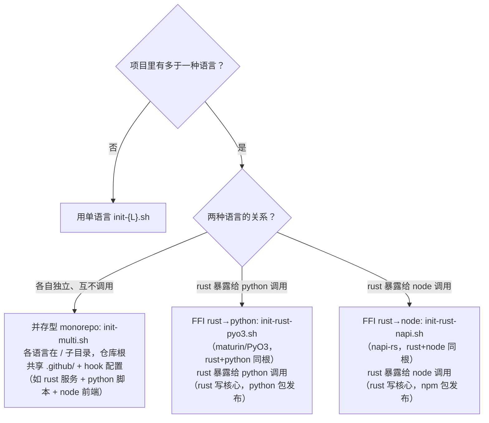

# 多语言项目指引

并存型 monorepo 与 FFI 绑定型的选型、hook 合并、CI 命名，以及非内置语言的手动并存步骤。

---

## 形态决策树



**选型要点**：并存型 = 多个独立交付物（各自 registry、各自 ci）；FFI 型 = 一个交付物里两种语言（rust 核心 + 绑定层，同根，发布到绑定语言的 registry）。

---

## 三脚本对照

| 脚本                | 形态            | 语言根布局           | 谁管骨架                      | 谁管 harness                |
| ------------------- | --------------- | -------------------- | ----------------------------- | --------------------------- |
| `init-multi.sh`     | 并存型 monorepo | `<lang>/` 子目录     | 本脚本（cargo/uv/pnpm init）  | 本脚本                      |
| `init-rust-pyo3.sh` | FFI rust→python | rust+python **同根** | `maturin new --mixed`（前置） | 本脚本（apply_ffi_harness） |
| `init-rust-napi.sh` | FFI rust→node   | rust+node **同根**   | `napi new`（前置，交互式）    | 本脚本（apply_ffi_harness） |

FFI 脚本**半自动**：官方工具管骨架（maturin 非交互可参数化；napi 纯交互无法脚本化），skill 管 harness（CI/release/hook/配置）。产物未就位时脚本 die 提示先跑官方命令。

---

## 并存型 hook 合并（手动，agent 执行）

`init-multi.sh` 把主语言的 `.pre-commit-config.yaml` / `lefthook.yml` 作基底，次语言拷成 `{lang}-.pre-commit-config.yaml` / `{lang}-lefthook.yml` 片段。**合并是语义任务**（该给次语言加哪些检查、去重哪些），不自动深合并 YAML（易错）。步骤：

1. 以主语言的 `.pre-commit-config.yaml` / `lefthook.yml` 为基底。
2. 读次语言的 `{lang}-.pre-commit-config.yaml` / `{lang}-lefthook.yml`，提取该语言**专属** hook。
3. **去重**：以下 hook 主语言基底已含，次语言片段删除同名项：
   - 私钥扫描（`BEGIN ... PRIVATE KEY` / `sk-...` grep）
   - commit-msg（conventional commits 格式校验）
4. 把次语言专属 hook 追加到基底（pre-commit 加 `repos:` 条目；lefthook 在对应 `pre-commit`/`pre-push` 段加 `commands:`）。
5. 删除 `{lang}-.pre-commit-config.yaml` / `{lang}-lefthook.yml` 片段文件。

### 每语言专属 hook 清单（合并时追加这些，去重私钥/commit-msg）

| 语言   | format                       | lint                                    | 安全审计                             | 类型/测试                              |
| ------ | ---------------------------- | --------------------------------------- | ------------------------------------ | -------------------------------------- |
| rust   | `cargo fmt --check`          | `cargo clippy -D warnings`              | `cargo deny` + `cargo audit`         | `cargo llvm-cov --fail-under-lines 80` |
| python | `uv run ruff format --check` | `uv run ruff check` + `uv run mypy src` | `uv run bandit` + `uv run pip-audit` | （pytest 由 ci.yml 跑）                |
| node   | `pnpm exec prettier --check` | `pnpm exec eslint`                      | `pnpm audit --prod`                  | `pnpm run typecheck`                   |

> 例：`init-multi.sh rust,python` → rust 基底（fmt/clippy/deny/audit/coverage/私钥/commit-msg）+ python 片段追加（ruff format/ruff check/mypy/bandit/pip-audit），python 片段里的私钥扫描与 commit-msg 删除（rust 基底已有）。

---

## CI 文件命名

并存型/FFI 型的次语言 workflow 自动加 `{lang}-` 前缀，避免覆盖主语言基底：

| 文件                                   | 含义                                                                        |
| -------------------------------------- | --------------------------------------------------------------------------- |
| `.github/workflows/ci.yml`             | 主语言 CI（无前缀，基底）                                                   |
| `.github/workflows/{lang}-ci.yml`      | 次语言 CI                                                                   |
| `.github/workflows/release.yml`        | 主语言 Release                                                              |
| `.github/workflows/{lang}-release.yml` | 次语言 Release（各走各的 registry secret）                                  |
| `.github/workflows/codeql.yml`         | CodeQL（仅主语言基底有；多语言可手动复制成 `{lang}-codeql.yml` 或合并 job） |

每个 `{lang}-release.yml` 独立用各自 registry secret（`${{ secrets.CARGO_REGISTRY_TOKEN }}` / `PYPI_TOKEN` / `NPM_TOKEN`），互不影响，无 secret 跳过。

---

## FFI 型前置命令

### rust→python（maturin/PyO3）

```bash
# 官方脚手架（非交互，参数化）——在空目录
maturin new --mixed --bindings pyo3 my-pyo3-pkg
cd my-pyo3-pkg
# 叠加 harness
bash ~/.claude/skills/pangu/scripts/init-rust-pyo3.sh
```

产物布局（maturin mixed layout）：根 `Cargo.toml` + `pyproject.toml`（含 `[tool.maturin]`）+ `python/<pkg>/` + `src/lib.rs`。

### rust→node（napi-rs）

```bash
# 官方脚手架（纯交互式，会 prompt 包名/目标平台/GitHub actions）——在空目录
napi new
cd <生成的目录>
# 叠加 harness
bash ~/.claude/skills/pangu/scripts/init-rust-napi.sh
```

产物布局：根 `Cargo.toml` + `package.json`（含 napi 脚本）+ `index.d.ts` + napi 生成的 `.github/workflows/`（universal CI）。

> napi 自带 universal CI 处理多平台构建；若与本 harness 的 `node-ci.yml` 冲突，以 napi 生成版本为准，删 `node-ci.yml`。

---

## 非内置语言手动并存（java/go/cpp/ruby/php/dotnet）

`init-multi.sh` 第一版仅内置 rust/python/node（脚手架能在预设子目录干净跑）。含其他语言的组合，手动并存：

```bash
# 1. 各语言在 <lang>/ 子目录跑对应单语言脚本（PROJ_DIR 默认当前目录）
mkdir my-monorepo && cd my-monorepo
mkdir rust java && cd rust   && bash ~/.claude/skills/pangu/scripts/init-rust.sh   && cd ..
cd java && bash ~/.claude/skills/pangu/scripts/init-java.sh && cd ..

# 2. 第二个语言会覆盖根的 ci.yml/release.yml/lefthook.yml/.pre-commit-config.yaml
#    手动把后拷语言的冲突文件改名（加 {lang}- 前缀作片段）:
#    ci.yml → java-ci.yml, release.yml → java-release.yml,
#    lefthook.yml → java-lefthook.yml, .pre-commit-config.yaml → java-.pre-commit-config.yaml

# 3. 按「并存型 hook 合并」语义合并 hook 片段，删除片段文件

# 4. .gitignore 天然追加合并（_common.sh:65-70），无需手动处理
```

> 为什么不内置：`mvn archetype:generate` / `bundle gem` 等脚手架会在预设目录里再建一层目录（嵌套），与 init-multi 的 `<lang>/` 子目录约定冲突，需逐语言适配。待需求明确再扩展。
